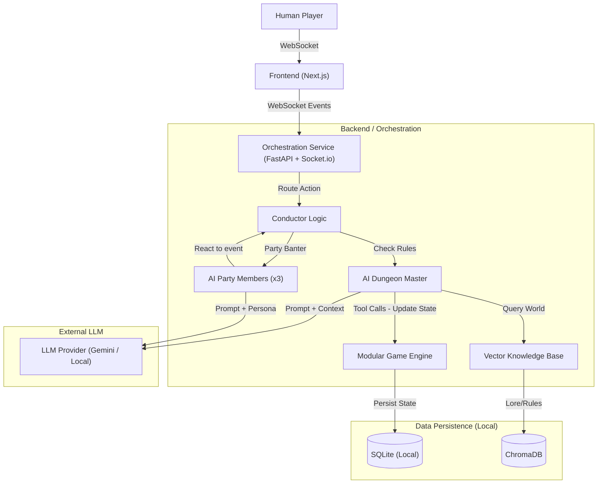

# RoundTable_4_1 Architecture & Design Document

## 1. High-Level Architecture Diagram



## 2. Tech Stack Recommendation

### Frontend
*   **Framework**: **Next.js 16 (App Router)** - For robust routing, server-side rendering, and React ecosystem.
*   **Styling**: **Tailwind CSS 4 + Framer Motion** - For "premium" feel and micro-animations.
*   **Real-time Client**: **Socket.io-client** - Robust WebSocket handling.
*   **State Management**: **Zustand** - Simple, fast state management for the complex game state.
*   **Visuals**: **Typing Indicators** - Sidebar avatars will glow/animate when an entity is "thinking" or typing.

### Backend / Orchestration Service
*   **Language**: **Python 3.11+**
*   **API Framework**: **FastAPI**
*   **Real-time Server**: **Python-SocketIO**
*   **Agent Framework**: **LangGraph + LangChain**
*   **LLM Interface**: **LangChain Google GenAI / LiteLLM**
    *   **Default**: **Gemini 1.5/2.0 Flash** (Fast by default).
    *   **Option**: Integrated switch for **Local LLM** (Ollama/LM Studio) for privacy/offline.

### Database & Auth (Local / Hacker Mode)
*   **Primary DB**: **SQLite** (`game.db`). Simple, file-based, no setup.
*   **Auth**: **Local Identity**. Users just pick a username. Persistent within the local database but no cloud sync.
*   **Vector DB**: **ChromaDB**. Runs locally in-process to store lore and rules embeddings.

## 3. Data Schema (GameState Models)

Implementation based on `backend/app/models.py`.

```json
{
  "session_id": "uuid-v4",
  "turn_index": 42,
  "active_entity_id": "goblin_archer_1",
  "phase": "combat", 
  "ruleset": "5e_SRD", 
  "dm_settings": {
    "strictness_level": "normal",
    "dice_fudging": true,
    "narrative_focus": "high" 
  },
  "location": {
    "name": "The Weeping Caverns",
    "description": "Damp, echoing capabilities with luminescent fungi."
  },
  "party": [
    {
      "id": "player_1",
      "name": "Valerius",
      "role": "Paladin",
      "is_ai": false,
      "hp_current": 25,
      "hp_max": 30,
      "inventory": ["Longsword", "Potion of Healing"],
      "status_effects": ["blessed"],
      "position": { "q": 0, "r": 0, "s": 0 }
    },
    {
      "id": "ai_party_1",
      "name": "Thorne",
      "role": "Rogue",
      "is_ai": true,
      "hp_current": 18,
      "hp_max": 20,
      "inventory": ["Dagger", "Thieves Tools"],
      "position": { "q": 1, "r": -1, "s": 0 }
    }
  ],
  "enemies": [
    {
      "id": "goblin_archer_1",
      "name": "Goblin Sniper",
      "is_ai": true,
      "hp_current": 5,
      "hp_max": 7,
      "position": { "q": 10, "r": -10, "s": 0 }
    }
  ],
  "combat_log": [
    {
      "tick": 41,
      "actor_id": "player_1",
      "action": "Attack",
      "target_id": "goblin_archer_1",
      "result": "Hit! 6 Damage.",
      "timestamp": "2023-10-27T10:00:00Z"
    }
  ],
  "chat_history": [
    {
      "id": "msg_123",
      "sender_id": "player_1",
      "sender_name": "Valerius",
      "content": "I scan the room for traps.",
      "timestamp": "2023-10-27T10:05:00Z"
    },
    {
      "id": "msg_124",
      "sender_id": "dm",
      "sender_name": "Dungeon Master",
      "content": "You notice a fainttripwire near the chest.",
      "timestamp": "2023-10-27T10:05:02Z"
    }
  ]
}
```

## 4. Data Persistence Strategy

The system requires strict persistence for game state and chat history.

*   **Game State**: Snapshot saved after every "Tick" or major event to SQLite `game_state` table.
*   **Chat History**: Every message (User or AI) is appended to a `chat_log` table in SQLite, indexed by `campaign_id`. This allows for complete replayability and context retrieval.


## 5. Agent Prompt Strategy

### A. The Separation of Concerns
1.  **System Prompt (The Soul)**: Immutable core personality.
2.  **Context Prompt (The Memory & Rules)**: 
    *   **Immediate Situation**: Room desc, last 5 messages.
    *   **Rule Injection**: Relevant rules for the current context (e.g., if casting a spell, inject spellcasting rules). *Crucial for preventing hallucinations.*
3.  **Task Prompt (The Directive)**: Specific goal for generation.

### B. The Conductor Pattern (Orchestration)
*   **Input**: Human sends message "I open the chest."
*   **Conductor Logic**: 
    1.  Block all Party AI.
    2.  Route to DM Agent.
    3.  DM Agent tool-calls `check_trap(chest_id)`.
    4.  DM Agent output: "The chest clicks. Roll a DEX save."
    5.  Conductor unblocks Party AI to react.

## 6. New Features / Roadmap
*   **Character Creation Wizard**: A dedicated wizard flow to build the player character (Stats, Class, Backstory) before entering the game session.
*   **Real-time Chat**: WebSocket-based chat interface with "typing" indicators for AI agents.
*   **Local-First Architecture**: Fully local stack (SQLite + ChromaDB) for privacy and ease of setup.
