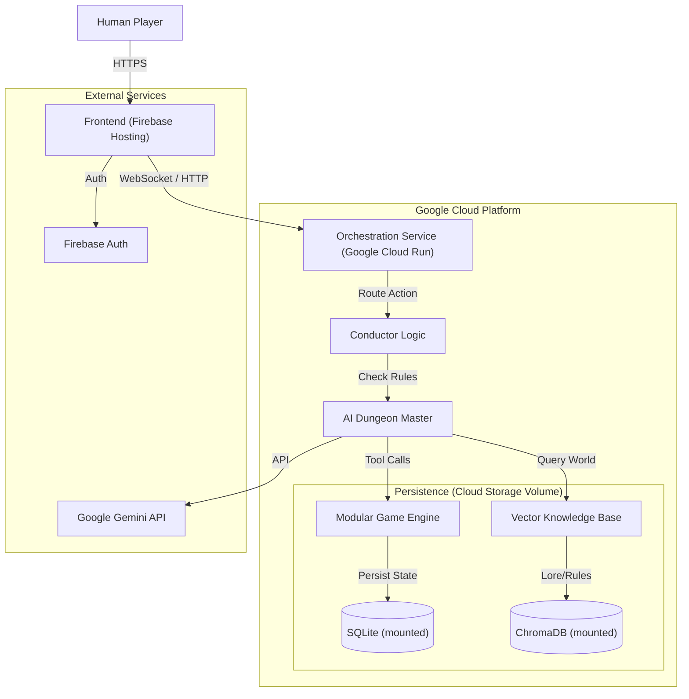

# RoundTable_4_1 Architecture & Design Document

## 1. High-Level Architecture Diagram



## 2. Tech Stack

### Frontend
*   **Hosting**: **Google Firebase Hosting**.
*   **Framework**: **Vite + React** (SPA).
*   **Language**: **TypeScript**.
*   **Styling**: **Tailwind CSS 4 + Framer Motion**.
*   **Real-time Client**: **Socket.io-client**.
*   **State Management**: **Zustand**.

### Backend / Orchestration Service
*   **Hosting**: **Google Cloud Run** (Serverless Container).
*   **Language**: **Python 3.11+**.
*   **API Framework**: **FastAPI**.
*   **Real-time Server**: **Python-SocketIO** (ASGI).
*   **Agent Framework**: **LangGraph + LangChain**.
*   **LLM Interface**: **Google GenAI (Gemini)**.

### Database & Persistence
*   **Primary DB**: **SQLite** (`game.db`) stored on a **Cloud Run Persistent Volume**.
*   **Vector DB**: **ChromaDB** stored on a **Cloud Run Persistent Volume**.
*   **Auth**: **Firebase Authentication** (Google Sign-In / Email).

### Repository
*   **Visibility**: **Private**.
*   **Platform**: **GitHub**.

## 3. Data Schema (GameState Models)

Implementation based on `backend/app/models.py`.

```json
{
  "session_id": "uuid-v4",
  "turn_index": 42,
  "active_entity_id": "goblin_archer_1",
  "phase": "combat", 
  "ruleset": "5e_SRD", 
  "dm_settings": {
    "strictness_level": "normal",
    "dice_fudging": true,
    "narrative_focus": "high" 
  },
  "location": {
    "name": "The Weeping Caverns",
    "description": "Damp, echoing capabilities with luminescent fungi."
  },
  "party": [
    {
      "id": "player_1",
      "name": "Valerius",
      "role": "Paladin",
      "is_ai": false,
      "hp_current": 25,
      "hp_max": 30,
      "inventory": ["Longsword", "Potion of Healing"],
      "status_effects": ["blessed"],
      "position": { "q": 0, "r": 0, "s": 0 }
    }
  ],
  "chat_history": [
    {
      "id": "msg_123",
      "sender_id": "player_1",
      "sender_name": "Valerius",
      "content": "I scan the room for traps.",
      "timestamp": "2023-10-27T10:05:00Z"
    }
  ]
}
```

## 4. Data Persistence Strategy

The system uses **Cloud Run Volumes** to persist files across container restarts.

*   **Game State**: Snapshot saved to SQLite `game.db` in `/data` volume.
*   **Vector Index**: ChromaDB persisted in `/data/chroma_db`.

## 5. Agent Prompt Strategy

### A. The Separation of Concerns
1.  **System Prompt (The Soul)**: Immutable core personality.
2.  **Context Prompt (The Memory & Rules)**: 
    *   **Immediate Situation**: Room desc, last 5 messages.
    *   **Rule Injection**: Injected via RAG (ChromaDB).
3.  **Task Prompt (The Directive)**: Specific goal for generation.

## 6. Roadmap
*   **Character Creation Wizard**: Completed.
*   **Real-time Chat**: Implemented via Socket.IO.
*   **Cloud Deployment**: Active on Google Cloud Run + Firebase.
